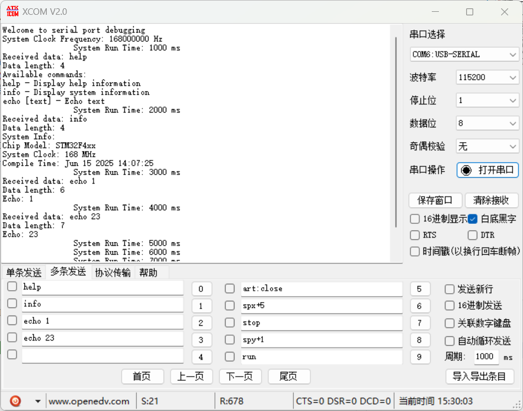

# STM32F407 UART 调试与应用示例

## 1. 项目简介

本项目是基于 STM32F407ZGT6 微控制器的一个串口通信示例，主要实现了通过 UART4 进行数据收发，并集成了 `printf` 重定向功能，方便进行调试输出。项目结构清晰，分为应用程序逻辑、底层串口驱动和测试模块，易于理解和扩展。

## 2. 主要功能

*   **UART4 串口通信**:
    *   使用 STM32 HAL 库和 DMA (Direct Memory Access) 实现高效的串口数据接收和发送。
    *   支持空闲中断 (Idle Line Detection) 接收，能够自动检测数据包的结束。
    *   接收缓冲区大小为 256 字节，发送缓冲区大小为 256 字节。
*   **`printf` 重定向**:
    *   将标准库的 `printf` 函数重定向到 UART4，可以直接通过串口输出调试信息。
    *   利用 DMA 加速 `printf` 输出，提高调试效率。
*   **命令行交互**:
    *   通过串口接收用户输入的命令，并进行解析和处理。
    *   支持的命令包括：
        *   `help`: 显示可用命令列表。
        *   `info`: 显示系统信息，如芯片型号、系统时钟频率和编译时间。
        *   `echo [text]`: 回显用户输入的文本。
*   **系统运行时间显示**:
    *   周期性地通过串口输出系统当前的运行时间。

## 3. 模块说明

### 3.1 `Code/app.c` & `Code/app.h`

*   **`app.c`**: 包含应用程序的入口点和主要逻辑。
    *   `APP_Init()`: 初始化系统和外设。
    *   `APP_Process()`: 周期性任务处理，如命令解析和状态显示。
    *   `APP_Test()`: 用于执行特定测试功能。
*   **`app.h`**: 声明 `app.c` 中定义的函数和外部变量。

### 3.2 `Code/usb_uart.c` & `Code/usb_uart.h`

*   **`usb_uart.c`**: 实现了 UART4 的底层驱动和 `printf` 重定向功能。
    *   `USB_UART_Init()`: 初始化 UART4，配置 DMA 接收和空闲中断。
    *   `USB_UART_ReceiveToIdle_DMA()`: 启动 DMA 接收，直到检测到总线空闲。
    *   `USB_UART_Transmit(uint8_t *data, uint16_t size)`: 使用 DMA 发送数据。
    *   `USB_UART_GetRxLen()`: 获取当前接收到的数据长度。
    *   `USB_UART_ClearRxBuffer()`: 清空接收缓冲区。
    *   `__io_putchar` / `fputc`: `printf` 重定向的实现，将字符通过 DMA 发送到 UART4。
    *   `HAL_UART_TxCpltCallback()`: UART 发送完成回调函数，用于管理发送忙标志。
    *   `HAL_UART_ErrorCallback()`: UART 错误回调函数，用于错误处理和重新启动接收。
    *   `HAL_UARTEx_RxEventCallback()`: UART 接收事件回调函数（空闲中断），处理接收到的数据。
*   **`usb_uart.h`**: 声明 `usb_uart.c` 中定义的函数、宏定义和外部变量，如 `DEBUG_UART`、`DEBUG_UART_RX_BUFFER_SIZE`、`uart_rx_buffer` 等。

### 3.3 `Code/Test/test_usb_uart.c` & `Code/Test/test_usb_uart.h`

*   **`test_usb_uart.c`**: 包含了串口调试功能的测试实现。
    *   `Test_ProcessCommand()`: 负责解析和处理通过串口接收到的命令，如 `help`、`info`、`echo`。
    *   `Test_ShowSystemInfo()`: 显示系统相关信息。
    *   `Test_EchoCommand(char *text)`: 实现简单的文本回显功能。
    *   `Test_ShowRunTime()`: 周期性地显示系统运行时间。
    *   `USB_UART_Test()`: 包含一个主测试循环，持续处理命令和显示运行时间。
*   **`test_usb_uart.h`**: 声明 `test_usb_uart.c` 中定义的测试相关函数。

## 4. 使用方法

1.  **硬件连接**: 确保 STM32F407 开发板的 UART4 (PA0/PA1) 连接到 USB 转串口模块或调试器。
2.  **编译与烧录**: 使用 Keil MDK 或其他兼容的 IDE 编译项目，并将固件烧录到 STM32F407 微控制器。
3.  **串口调试**:
    *   打开串口调试助手，配置波特率（根据 `main.c` 或 STM32CubeMX 配置），通常为 115200。
    *   通过串口助手发送命令（如 `help`、`info`、`echo your_text`），项目将通过 `APP_Process()` 中的 `Test_ProcessCommand()` 进行处理并返回结果。
    *   通过 `printf` 函数输出的调试信息和系统运行时间将在串口助手上显示。

## 5. 注意事项

*   本项目的 UART 配置（如波特率、数据位、停止位、校验位）应与 `main.c` 或 STM32CubeMX 生成的配置保持一致。
*   在实际应用中，应根据具体需求调整 `DEBUG_UART_RX_BUFFER_SIZE` 和 `DEBUG_UART_TX_BUFFER_SIZE` 的大小。

## 6. 测试结果
